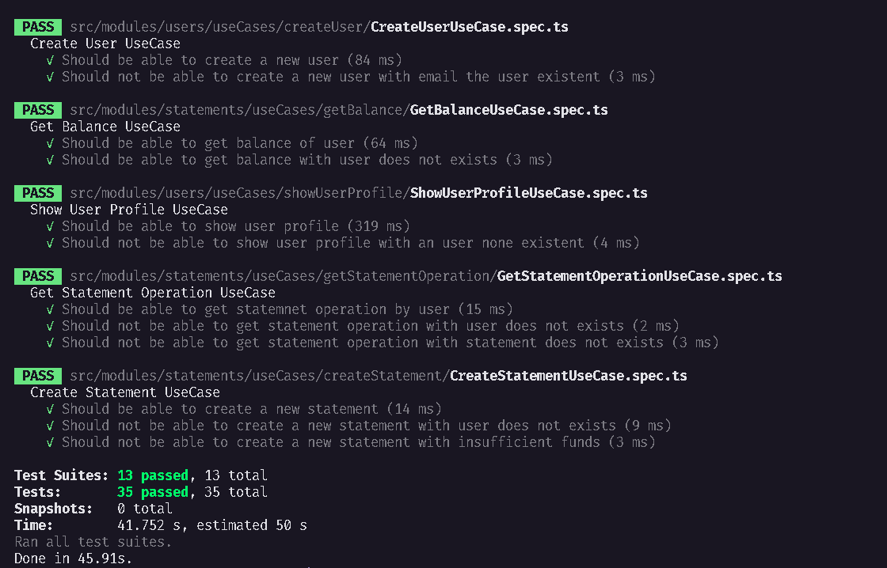

<h1 align="center">
FinanceAPI - Desafio 08, 09 e 10 concluídos - Testes unitários, integrações e novas funcionalidades
</h1>

## 💫 Sobre o desafio 08
Nesse desafio, você deverá criar testes unitários para uma aplicação já pronta usando tudo que aprendeu até agora sobre testes.

## 💫 Sobre o desafio 09
Nesse desafio, você deverá criar testes de integração para a mesma aplicação usada no desafio anterior.

## 💫 Sobre o desafio 10
A nova funcionalidade deverá permitir a transferência de valores entre contas. Para isso, você pode pensar na melhor forma de construir essa solução mas alguns requisitos deverão ser cumpridos:

- Não deve ser possível transferir valores superiores ao disponível no saldo de uma conta;
- O balance (obtido através da rota `/api/v1/statements/balance`) deverá considerar também todos os valores transferidos ou recebidos através de transferências ao exibir o saldo de um usuário;
- As informações para realizar uma transferência serão:

    ```json
    {
    	"amount": 100,
    	"description": "Descrição da transferência"
    }
    ```

    Você pode passar o `id` do usuário destinatário via parâmetro na rota (exemplo: `/api/v1/statements/transfers/:user_id`) e o id do usuário remetente poderá ser obtido através do token JWT enviado no header da requisição;

- Ao mostrar o balance de um usuário, operações do tipo `transfer` deverão possuir os seguintes campos:

    ```json
    {
      "id": "4d04b6ec-2280-4dc2-9432-8a00f64e7930",
    	"sender_id": "cfd06865-11b9-412a-aa78-f47cc3e52905"
      "amount": 100,
      "description": "Transferência de valor",
      "type": "transfer",
      "created_at": "2021-03-26T21:33:11.370Z",
      "updated_at": "2021-03-26T21:33:11.370Z"
    }
    ```

    Observe o campo `sender_id`. Esse deverá ser o `id` do usuário que enviou a transferência.
    O campo `type` também deverá exibir o tipo da operação, que nesse caso é `transfer`.

## ✅ Testes 08 & 09



## 🚀 Tecnologias
<p>


</p>

---
